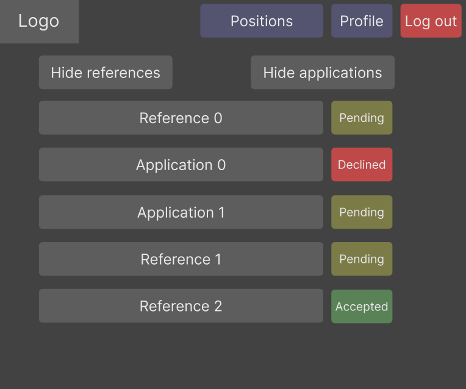
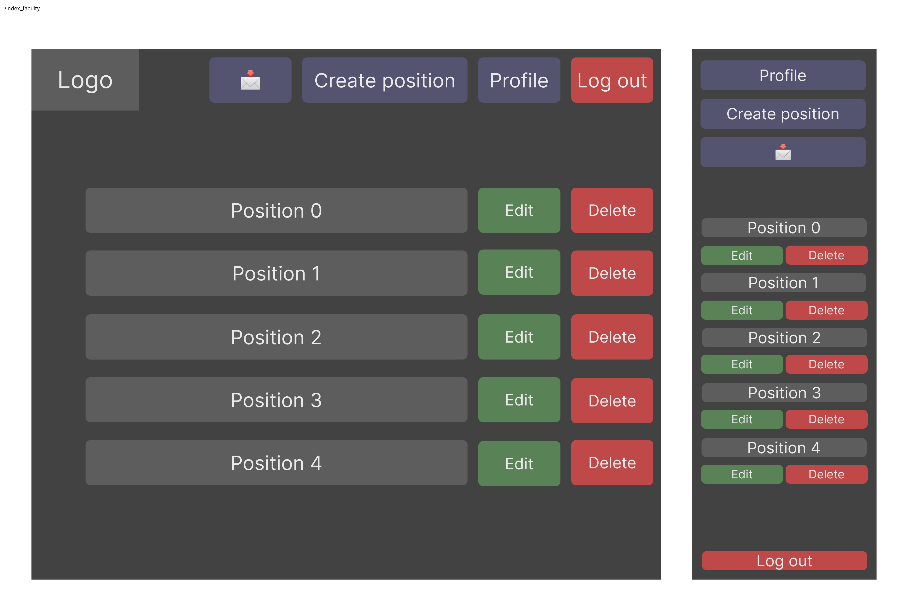
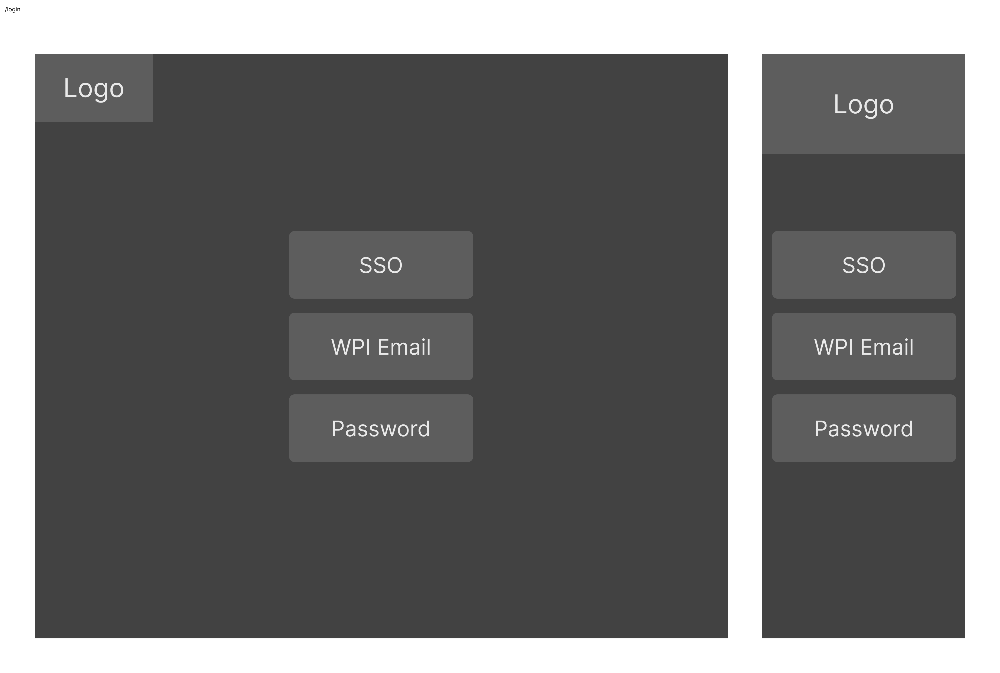
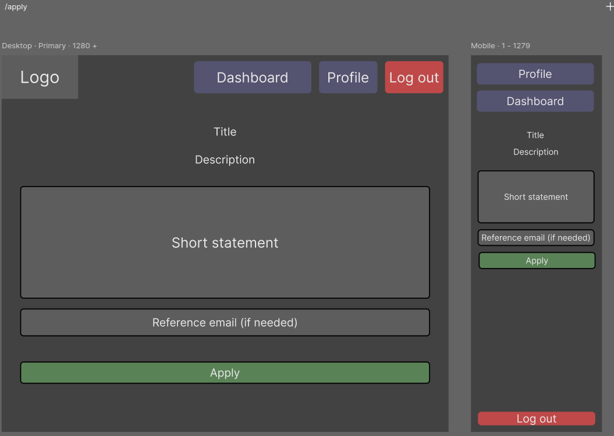

# Software Requirements and Use Cases

## Your Project Title
--------
Prepared by:

* `<Kevin Lai>`,`<resumemaxxers>`
* `<Ziyue Chen>`,`<resumemaxxers>`
* `<JimXiang>`,`<resumemaxxers>`
* `<Matvey Shestopalov>`,`<resumemaxxers>`

---

**Course** : CS 3733 - Software Engineering

**Instructor**: Sakire Arslan Ay

---

## Table of Contents
- [1. Introduction](#1-introduction)
- [2. Requirements Specification](#2-requirements-specification)
  - [2.1 Customer, Users, and Stakeholders](#21-customer-users-and-stakeholders)
  - [2.2 User Stories](#22-user-stories)
  - [2.3 Use Cases](#23-use-cases)
- [3. User Interface](#3-user-interface)
- [4. Product Backlog](#4-product-backlog)
- [4. References](#4-references)
- [Appendix: Grading Rubric](#appendix-grading-rubric)

## Document Revision History

| Name | Date | Changes | Version |
| ------ | ------ | --------- | --------- |
|Revision 1 |2024-11-07 |Initial draft | 1.0        |
|      |      |         |         |
|      |      |         |         |

----
# 1. Introduction

Provide a short description of the software being specified. Describe its purpose, including relevant benefits, objectives, and goals.

Our software facilitates an easier connection between faculty and students about research opportunities and positions, particularly those not teaching undergraduate classes.  Faculty can easily reach out to students interested in their respected major. This application dissolves the barrier between students and faculty in different degree levels, and ensures qualified sophomores and juniors the opportunity to utilize their talents fully and further their academic/professional career. Students also have the opportunity to explore various research topics aligned with their interests.

----
# 2. Requirements Specification

This section specifies the software product's requirements. Specify all of the software requirements to a level of detail sufficient to enable designers to design a software system to satisfy those requirements, and to enable testers to test that the software system satisfies those requirements.

## 2.1 Customer, Users, and Stakeholders

A brief description of the customer, stakeholders, and users of your software.

Customers/users include student and faculty that is part of the school organization who benefits from our software.

----
## 2.2 User Stories
This section will include the user stories you identified for your project. Make sure to write your user stories in the form : 
"As a **[Role]**, I want **[Feature]** so that **[Reason/Benefit]** "

1. As a student, I would like to create my student account, so that I can maintain my personal and academic information accurately in the system.
2. As a student, I want to login to the system by using my email and password or the SSO, so that I can securely access my account and manage my applications.
3. As a student, I want to view all the available research positions for me, and also see the details of the position when I click on it, so that I can explore different positions that match my interests.
4. As a student, I want to view all the recommended positions that best fit my major and interests presented in the profile, so that I can easily find research positions that best fit my profile and skills.
5. As a student, I would like to apply for a research position, so that I can submit my application and be reviewed by the faculties.
6. As a student, I want to view application status and reference updates, so that I can track the progress of my applications and stay informed about any changes or feedback made by the supervisor.
7. As a student, I want to withdraw my “pending” applications, so that I can manage my application list and avoid confusion with positions I no longer want to pursue.
8. As a student, I want to select from a predefined list of values (including date, time, etc.) so I can filter the available research opportunities and choose the most suitable one.
9. As a student, I want to view the detailed information of recommended positions, so that I can evaluate the project.
10. As a student. I want to reference a professor, so it will bolster my credibility in the application.
11. As a student, I would like to view and edit my profile information, so that I can adjust my personal and academic information in the system.

1. As a faculty, I want to activate my account so I can access the system, post research positions, and complete my profile
2. As a faculty, I want to login with username and password, so that I can access the system and post research positions
3. As a faculty, I want to view my account profile so I can have a reference and see recommendation requests
4. As a faculty, I want to create undergraduate research positions so that students can apply to different researches and solve for a real-life problem.
5. As a faculty, I want to view my list of applicants for my research position so I can figure out who I want to accept
6. As a faculty, I want to view a student applicant’s profile so I can figure out whose application I want to approve or reject
7. As a faculty, I want to approve student applications so they can be accepted into the research position
8. As a faculty, I want to reject student applications so better people can be accepted
9. As a faculty, I want to edit the predefined list of values from which user can select so they have more diversity of choice
10. As a faculty, I want to edit or delete undergraduate research positions, in case I made a mistake.
11. As a faculty, I want to be notified when a student references me in their application so I can approve or decline the reference

----
## 2.3 Use Cases

This section will include the specification for your project in the form of use cases. 

Group the related user stories and provide a use case for each user story group. You don't need to draw the use-case diagram for the use cases; you will only provide the textual descriptions.  **Also, you don't need to include the use cases for "registration" and "login" use cases for both student and faculty users.**

  * First, provide a short description of the actors involved (e.g., regular user, administrator, etc.) and then follow with a list of the use cases.
  * Then, for each use case, include the following:

    * Name,
    * Participating actors,
    * Entry condition(s) (in what system state is this use case applicable),
    * Exit condition(s) (what is the system state after the use case is done),
    * Flow of events (how will the user interact with the system; list the user actions and the system responses to those),
    * Alternative flow of events (what are the exceptional cases in the flow of events and they will be handles)
    * Iteration # (which sprint do you plan to work on this use case) 

Each use case should also have a field called "Iteration" where you specify in which iteration you plan to implement this feature.

You may use the following table template for your use cases. Copy-paste this table for each use case you will include in your document.

| Use case # 1      |   |
| ------------------ |--|
| Name              | ""  |
| Participating actor  | ""  |
| Entry condition(s)     | ""  |
| Exit condition(s)           | ""  |
| Flow of events | ""  |
| Alternative flow of events    | ""  |
| Iteration #         | ""  |

| Use case # 1      |  |
| ------------------ |--|
| Name        | “View available positions” |
| Participating actor  | “Student” |
| Entry condition(s)     | “Student login to the system and enter the search page” |
| Exit condition(s)           | "Student select one of the positions or enters another page"  |
| Flow of events | " Student login to their account -> go to search page .--> view provided positions -> click on an available position -> View available positions"  |
| Alternative flow of events    | ""  |
| Iteration #         | "#1 " |

| Use case # 2      | |
| ------------------ |--|
| Name        | “View recommended positions” |
| Participating actor  | “Student” |
| Entry condition(s)     | “Student login to the system and enter the search page” |
| Exit condition(s)           | "Student select one of the recommended positions or enters another page"  |
| Flow of events | " Student login to their account -> go to search page .--> view provided positions -> click on recommend positions -> View recommend positions"  |
| Alternative flow of events    | ""  |
| Iteration #         | "#1 "  |

| Use case # 3      | |
| ------------------ |--|
| Name              | “view research position details” |
| Participating actor  | “Student” |
| Entry condition(s)     | “Student is logged in and is viewing available/recommended positions” |
| Exit condition(s)      | “Student click on the x-out option” |
| Flow of events | “Student view provided position page ->view research position details -> student x-out the position detail”   |
| Alternative flow of events    | none |
| Iteration #         | " #1" |

| Use case # 4      | |
| ------------------ |--|
| Name              | "Apply for research position"  |
| Participating actor  | "Student"  |
| Entry condition(s)     | "Student is logged in and is viewing position details"  |
| Exit condition(s)  | "Student applied for research position"  |
| Flow of events | "Student opens application -> Student submits short statement -> Student is asked to provide faculty reference -> System sends notification to referenced professor -> Student submits application"  |
| Alternative flow of events    | "Student opens application -> Student closes application without submitting" |
| Iteration #         | "#2"  |

| Use case # 5     |   |
| ------------------ |--|
| Name              | “view application status and reference update"  |
| Participating actor  | "Student"  |
| Entry condition(s)     | "Student is logged in and enter dashboard"  |
| Exit condition(s)           | " Student leave dashboard or enter application details "  |
| Flow of events | “ Students enter their dashboard -> view application status and recommendation status after updates. "  |
| Alternative flow of events    | " none "  |
| Iteration #         | "#2 "  |

| Use case # 6      |   |
| ------------------ |--|
| Name              | " Withdraw “pending” applications"  |
| Participating actor  | " Student "  |
| Entry condition(s)     | " Student is logged in and applied to a position and is currently in pending state, student is viewing dashboard"  |
| Exit condition(s)           | " Student withdrew the applications or cancel the current action "  |
| Flow of events | "student check current state for their application -> if it is in “pending” state -> Student withdrew the application "  |
| Alternative flow of events    | "Student close application status page, waiting for the pending"  |
| Iteration #         | "#2"  |

| Use case # 7      |   |
| ------------------ |--|
| Name              | "Filter research opportunities"  |
| Participating actor  | "Student"  |
| Entry condition(s)     | "Student is logged in and viewing the research positions in search page"  |
| Exit condition(s)           | "Student closes or confirms filters"  |
| Flow of events | "Student clicks filter button in the search page -> student selects filter(s) -> student confirms the filters -> search results adjust accordingly"  |
| Alternative flow of events    | "Student clicks filter button in the search page -> student selects filter(s) -> Student close the search page"  |
| Iteration #         | "#1"  |

| Use case # 8      |   |
| ------------------ |--|
| Name              | "Reference a professor"  |
| Participating actor  | "Student"  |
| Entry condition(s)     | "Student is logged in and has referenced a professor"  |
| Exit condition(s)           | "Reference request sent"  |
| Flow of events | " Student reference a professor -> Reference request sent "  |
| Alternative flow of events    | ""  |
| Iteration #         | "#2"  |

| Use case # 9      |   |
| ------------------ |--|
| Name              | "View and edit student profile"  |
| Participating actor  | "Student"  |
| Entry condition(s)     | "User is logged in and is student"  |
| Exit condition(s)           | "User exits profile, returns to main page"  |
| Flow of events | "Student click on profile -> student click on the “edit profile” button -> edit the features in their profile -> click “save” button to save the change  "  |
| Alternative flow of events    | " Student click the “edit profile” button -> changed nothing and click “save” button -> pop-up a warning message to student  "  |
| Iteration #         | "#1"  |

| Use case # 10      |   |
| ------------------ |--|
| Name              | "View and edit faculty profile"  |
| Participating actor  | "Faculty"  |
| Entry condition(s)     | "User is logged in and is faculty"  |
| Exit condition(s)           | "User exits profile, returns to main page"  |
| Flow of events | "Faculty click on profile -> faculty click on the “edit profile” button -> edit the features in their profile -> click “save” button to save the change"  |
| Alternative flow of events    | "Faculty click the “edit profile” button -> changed nothing and click “save” button -> pop-up a warning message to faculty"  |
| Iteration #         | "#1"  |

| Use case # 11      |   |
| ------------------ |--|
| Name              | "Create undergraduate research position"  |
| Participating actor  | "Faculty"  |
| Entry condition(s)     | "User is logged in and is faculty"  |
| Exit condition(s)           | "Research position is created"  |
| Flow of events | “Faculty enter the create undergraduate research page -> User enters details of position -> User confirms position -> Position added to system"  |
| Alternative flow of events    |”If the user didn't fill out all the details of the research, pop-up a remind message about missing fields "  |
| Iteration #         | "#1"  |

| Use case # 12      |   |
| ------------------ |--|
| Name              | "Edit undergraduate research position"  |
| Participating actor  | "Faculty"  |
| Entry condition(s)     | "User is logged in and is faculty"  |
| Exit condition(s)           | "Research position is edited"  |
| Flow of events | "User selects research position to edit -> User modifies details -> Modifications saved to research position"  |
| Alternative flow of events    | "User selects research position to edit -> User does not modify details"  |
| Iteration #         | "#2"  |

| Use case # 13      |   |
| ------------------ |--|
| Name              | "Delete undergraduate research position"  |
| Participating actor  | "Faculty"  |
| Entry condition(s) | "User is logged in and is faculty, there are research position created"  |
| Exit condition(s)           | "Research position is created"  |
| Flow of events | "User selects research position -> User views details, deletes -> User confirms delete -> Research position is deleted from system"  |
| Alternative flow of events    |”If user does not confirm delete, let the research position remain in the system"  |
| Iteration #         | "#2"  |

| Use case # 14      |   |
| ------------------ |--|
| Name              | "view student application profiles"  |
| Participating actor  | "Faculty"  |
| Entry condition(s)     | "User is logged in and has created research positions, students applied, faculty is viewing applications"  |
| Exit condition(s)           | "faculty exit out the student application profile page"  |
| Flow of events | "faculty go to view student application page -> faculty exit out of the student application profile page"  |
| Alternative flow of events    | "  "  |
| Iteration #         | "#2"  |

| Use case # 15      |   |
| ------------------ |--|
| Name              | "View student profile for faculty"  |
| Participating actor  | "Faculty"  |
| Entry condition(s)     | "User is viewing list of student applications and is faculty"  |
| Exit condition(s)           | "User exits profile, returns to list of student applications"  |
| Flow of events | "User clicks on profile -> User views profile -> User exits profile "  |
| Alternative flow of events    | "           "  |
| Iteration #         | "#3"  |

| Use case # 16      |   |
| ------------------ |--|
| Name              | "approve student application"  |
| Participating actor  | "Faculty"  |
| Entry condition(s)     | "User is logged in as faculty and is viewing list of students who applied to their positions"  |
| Exit condition(s)           | "the status of those applications will be updated to “Approved.”"  |
| Flow of events | "User logged in -> user review student application ->  user approve student application -> student application updates to “Approved” "  |
| Alternative flow of events    | "user review student application -> user close the review student application page"  |
| Iteration #         | "#3"  |

| Use case # 17      |   |
| ------------------ |--|
| Name              | "reject student application"  |
| Participating actor  | "Faculty"  |
| Entry condition(s)     | "User is logged in as faculty and is viewing list of students who applied to their positions"  |
| Exit condition(s)           | "the status of those applications will be updated to “Rejected”
| Flow of events | "User logged in -> user review student application -> user reject student application -> student application updates to “Rejected"  |
| Alternative flow of events    | "user review student application -> user close the student application page"  |
| Iteration #         | "#3"  |

| Use case # 18      |   |
| ------------------ |--|
| Name              | "edit the predefined list of values from which user can select"  |
| Participating actor  | "Faculty"  |
| Entry condition(s)     | "User is logged in and is faculty"  |
| Exit condition(s)           | "Edited predefined list of values"  |
| Flow of events | "User enters edit mode -> User selects list to update -> User updates list -> User confirms update -> Update(s) saved to research position in the system "  |
| Alternative flow of events    | "User enters edit mode -> user exit edit mode, User selects list to update -> User makes no updates -> nothing saved "  |
| Iteration #         | "#3"  |

| Use case # 19      |   |
| ------------------ |--|
| Name              | "edit or delete undergraduate research positions"  |
| Participating actor  | "Faculty"  |
| Entry condition(s)     | "User is logged in as Faculty, undergraduate research position created, viewing current undergraduate research positions"  |
| Exit condition(s)           | "undergraduate research position edited or deleted and saved, or user exits without changes"  |
| Flow of events | "User is viewing undergraduate research positions -> edit or delete under graduate research position -> save the changes made for the research positions"  |
| Alternative flow of events    | "nothing changed or exit"  |
| Iteration #         | "#3"  |

| Use case # 20      |   |
| ------------------ |--|
| Name              | "Approve/decline student reference request"  |
| Participating actor  | "Faculty"  |
| Entry condition(s)     | "User is logged in as faculty, and is viewing notifications"  |
| Exit condition(s)           | “Reference status updates for user”  |
| Flow of events | "User views reference/notification -> User approves/declines reference -> Reference status updates for user"  |
| Alternative flow of events    | "User views reference/notification -> user close notifications page"  |
| Iteration #         | "#3"  |

| Use case # 21      |   |
| ------------------ |--|
| Name              | "Receive student reference notification"  |
| Participating actor  | "Faculty"  |
| Entry condition(s)     | "User is logged in as a faculty"  |
| Exit condition(s)           | "Notification received"  |
| Flow of events | "Student confirms reference request -> Receive notification"  |
| Alternative flow of events    | "  "  |
| Iteration #         | "#3"  |

----
# 3. User Interface

Here you should include the sketches or mockups for the main parts of the interface.
You may use Figma to design your interface:

  Example image. The image file is in the `./images` directory.
  <kbd>
      
  </kbd>

<kbd></img></kbd>

<kbd></img></kbd>

<kbd></img></kbd>

<kbd></img></kbd>

----
# 4. Product Backlog

Here you should include a link to your GitHub repo issues page, i.e., your product backlog. Make sure to create an issue for each user story.  

https://github.com/WPI-CS3733-2025B/team-resumemaxxers/issues

----
# 5. References

Cite your references here.

For the papers you cite, give the authors, the title of the article, the journal name, journal volume number, date of publication and inclusive page numbers. Giving only the URL for the journal is not appropriate.

For the websites, give the title, author (if applicable) and the website URL.

----
----
# Appendix: Grading Rubric
(Please remove this part in your final submission)

These is the grading rubric that we will use to evaluate your document. 

| Max Points  | **Content** |
| ----------- | ------- |
| 4          | Do the requirements clearly state the customers’ needs? |
| 2          | Do the requirements avoid specifying a design (note: customer-specified design elements are allowed)? |
| | |  
|    | **Completeness** |
| 14 | Are user stories complete? Are all major user stories included in the document?  |
| 5 | Are user stories written in the correct form? | 
| 14 |  Are all major use cases (except registration and login) included in the document? |
| 15 | Are use cases written in sufficient detail to allow for design and planning? Are the "flow of events" in use case descriptions written in the form of "user actions and system responses to those"? Are alternate flows of events provided (when applicable)? | 
| 6 |  Are the User Interface Requirements given with some detail? Are there some sketches, mockups?  |
| | |  
|   | **Clarity** |
| 5 | Is the document carefully written, without typos and grammatical errors?   Is each part of the document in agreement with all other parts?   Are all items clear and not ambiguous? |
| | |
|**65**|**TOTAL**|
