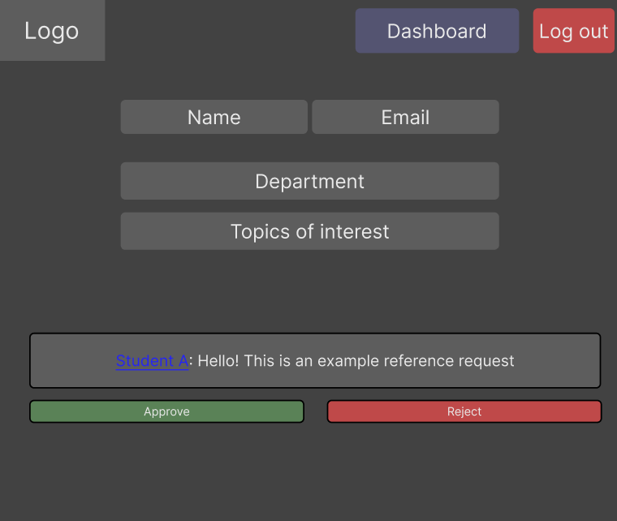
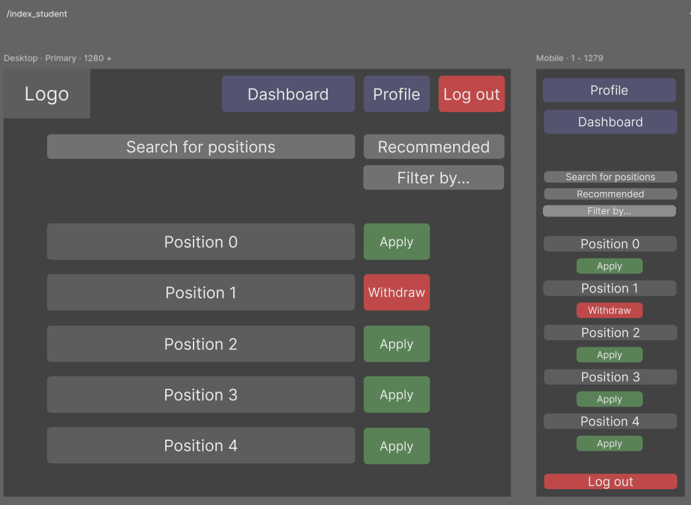
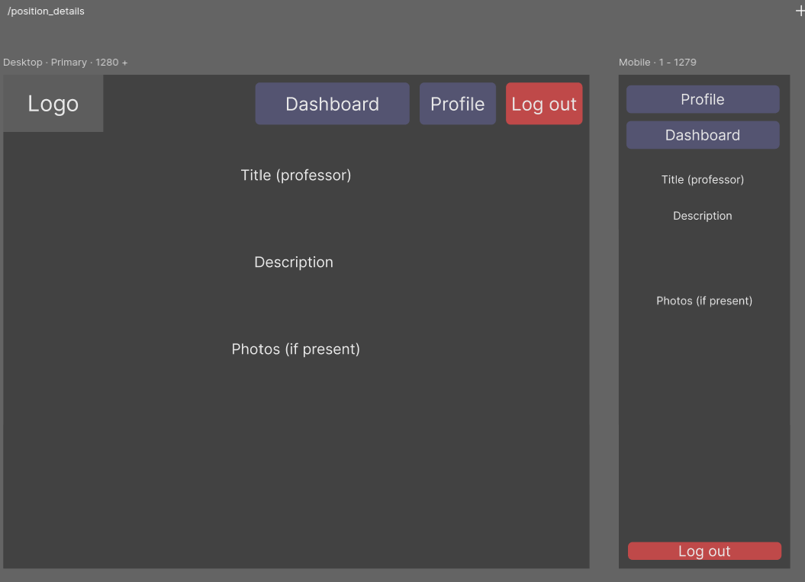
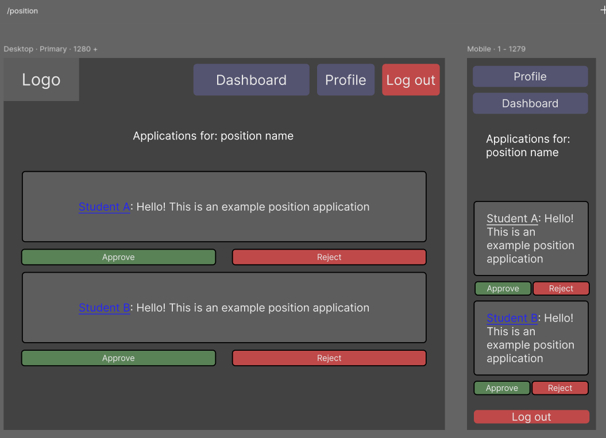

# Software Requirements and Use Cases

## Research Position Matcher
--------
Prepared by:

* `Kevin Lai`,`resumemaxxers`
* `Ziyue Chen`,`resumemaxxers`
* `Jim Xiang`,`resumemaxxers`
* `Matvey Shestopalov`,`resumemaxxers`

---

**Course** : CS 3733 - Software Engineering

**Instructor**: Sakire Arslan Ay

---

## Table of Contents
- [1. Introduction](#1-introduction)
- [2. Requirements Specification](#2-requirements-specification)
  - [2.1 Customer, Users, and Stakeholders](#21-customer-users-and-stakeholders)
  - [2.2 User Stories](#22-user-stories)
  - [2.3 Use Cases](#23-use-cases)
- [3. User Interface](#3-user-interface)
- [4. Product Backlog](#4-product-backlog)
- [4. References](#4-references)
- [Appendix: Grading Rubric](#appendix-grading-rubric)

## Document Revision History

| Name | Date       | Changes | Version |
| ------ |------------| --------- | --------- |
|Revision 1 | 2025-11-05 |Initial draft | 1.0        |
|Final revisions | 2025-11-06 | Final | 2.0         |
|      |            |         |         |

----
# 1. Introduction

Our software aims to facilitate easier communication between faculty and students regarding research positions and opportunities, particularly for faculty not teaching undergraduate classes. Faculty members can create research positions and easily reach out to undergraduate students interested in their respected major. This application dissolves the barrier between students and faculty in different degree levels, and ensures qualified sophomores and juniors the opportunity to utilize their talents fully and further their academic/professional career. Students also have the opportunity to explore various research topics aligned with their interests, filtering for recommended and available research positions to apply for. Faculty can access and mull over student profile details to discern talent and potential, in both student applications and references, for interviewing purposes. 

----
# 2. Requirements Specification

## 2.1 Customer, Users, and Stakeholders

Customers/users include student and faculty that is part of the school organization who create and access the application forms. Stakeholders include students who benefit from the experience provided by various research opportunities, and faculty who benefit from additional assistance from the students. The university administration is also interested in a streamlined research culture as an avenue towards enhancing their institutional reputation, as well as the project development team responsible the product's creation.

----
## 2.2 User Stories

1. As a student, I would like to create my student account, so that I can maintain my personal and academic information accurately in the system.
2. As a student, I want to login to the system by using my email and password or the SSO, so that I can securely access my account and manage my applications.
3. As a student, I want to view all the available research positions for me, and also see the details of the position when I click on it, so that I can explore different positions that match my interests.
4. As a student, I want to view all the recommended positions that best fit my major and interests presented in the profile, so that I can easily find research positions that best fit my profile and skills.
5. As a student, I would like to apply for a research position, so that I can submit my application and be reviewed by faculty.
6. As a student, I want to view application status and reference updates, so that I can track the progress of my applications and stay informed about any changes or feedback made by the supervisor.
7. As a student, I want to withdraw my “pending” applications, so that I can manage my application list and avoid confusion with positions I no longer want to pursue.
8. As a student, I want to select from a predefined list of values (including date, time, etc.) so I can filter the available research opportunities and choose the most suitable one.
9. As a student, I want to view the detailed information of recommended positions, so that I can evaluate the project.
10. As a student. I want to reference a professor, so it will bolster my credibility in the application.
11. As a student, I would like to view and edit my profile information, so that I can adjust my personal and academic information in the system.

1. As a faculty member, I want to activate my account so I can access the system, post research positions, and complete my profile
2. As a faculty member, I want to login with username and password, so that I can access the system and post research positions
3. As a faculty member, I want to view my account profile so I can have a reference and see recommendation requests
4. As a faculty member, I want to create undergraduate research positions so that students can apply to different researches and solve for a real-life problem.
5. As a faculty member, I want to view my list of applicants for my research position so I can figure out who I want to accept
6. As a faculty member, I want to view a student applicant’s profile so I can figure out whose application I want to approve or reject
7. As a faculty member, I want to approve student applications so they can be accepted into the research position
8. As a faculty member, I want to reject student applications so better people can be accepted
9. As a faculty member, I want to edit the predefined list of values from which user can select so they have more diversity of choice
10. As a faculty member, I want to edit or delete undergraduate research positions, in case I made a mistake.

----
## 2.3 Use Cases

| Use case #1 |  |
|--------------|--|
| Name | View and filter available and recommended positions |
| Participating actor | Student |
| Entry condition(s) | Student is logged in to the system and has entered the main page to view available or recommended research positions. |
| Exit condition(s) | Student selects and views one of the position’s details, confirms or closes filters, or navigates away to another page. |
| Flow of events | 1. The student navigates to the main page. 2. The system displays available research positions. 3. The student selects a position to view details. 4. The student reviews the research position information. 5. The student exits the detail view or returns to the search page.|
| Alternative flow of events | 1. The student navigates to the main page. 2. The student navigates to the “Recommended Positions” page. 3. The system displays recommended positions based on the student profile. 4. The student selects a recommended position to view details. 5. The student reviews the information and exits the view.  AND/OR  1. The student clicks the filter button on the search page. 2. The student selects one or more filters. 3. The student confirms the filter selection. 4. The system updates and displays the filtered search results. Alternatively, the student closes the filter window or exits without confirming, or views profiles without clicking on any of them |
| Iteration # | 1 |

| Use case #2 |  |
|--------------|--|
| Name | Apply for research position |
| Participating actor | Student |
| Entry condition(s) | Student is logged in and viewing position details. |
| Exit condition(s) | Student completes or cancels the application. |
| Flow of events | 1. The student opens the application form. 2. The student writes a short statement. 3. The student provides a faculty reference (optional). 4. The system sends a notification to the referenced professor if a reference is provided. 5. The student submits the application.  |
| Alternative flow of events | 1. The student opens the application form. 2. The student closes the form without submitting. Alternatively, the student sends an application without a reference. |
| Iteration # | 2 |

| Use case #3 |  |
|--------------|--|
| Name | View/modify application status and reference update |
| Participating actor | Student |
| Entry condition(s) | Student is logged in, has entered the dashboard and has at least one active or pending application. |
| Exit condition(s) | Student leaves the dashboard, views specific application details, and/or withdraws an application or cancels the withdrawal action. |
| Flow of events | 1. The student opens the dashboard. 2. The student views the current application status. 3. The student views the recommendation or reference status after updates. |
| Alternative flow of events | 1. The student checks the current state of their application. 2. The system verifies that the application is in a pending state. 3. The student confirms withdrawal. 4. The system updates the application status to “withdrawn” and displays a confirmation message. Alternatively, the student closes the page without taking any actions.|
| Iteration # | 2 |

| Use case #4 |                                                                                                                                      |
|--------------|--------------------------------------------------------------------------------------------------------------------------------------|
| Name | Reference a professor                                                                                                                |
| Participating actor | Student                                                                                                                              |
| Entry condition(s) | Student is logged in and is in the application page.                                                                        |
| Exit condition(s) | Reference request is sent and shows up in the notification/profile page                                                                                                          |
| Flow of events | 1. The student enters the professor’s information in the references section. 2. The system sends the reference request.                                        |
| Alternative flow of events | 1. The student enters a non-existing professor's information. 2. The system notifies the student that such a professor does not exist. |
| Iteration # | 2                                                                                                                                    |

| Use case #5 |  |
|--------------|--|
| Name | View and edit own profile |
| Participating actor | Student, faculty |
| Entry condition(s) | Student/Faculty is logged in. |
| Exit condition(s) | User edits the profile and saves, or makes no changes and returns to the main page. |
| Flow of events | 1. The user clicks on the profile. 2. The user edits profile information. 3. The user clicks the save button. 4. The system updates the profile. |
| Alternative flow of events | The user clicks on the profile, then immediately exits |
| Iteration # | 1 |

| Use case #6 |  |
|--------------|--|
| Name | Create undergraduate research position |
| Participating actor | Faculty |
| Entry condition(s) | Faculty is logged in. |
| Exit condition(s) | Research position created. |
| Flow of events | 1. The faculty opens the create research position page. 2. The faculty enters position details. 3. The faculty confirms creation. 4. The system saves the position. |
| Alternative flow of events | 1. The faculty submits incomplete details. 2. The system displays a reminder about missing fields. |
| Iteration # | 1 |

| Use case #7 |  |
|--------------|--|
| Name | Edit and delete undergraduate research position |
| Participating actor | Faculty |
| Entry condition(s) | Faculty is logged in. |
| Exit condition(s) | Research position edited or deleted. |
| Flow of events | 1. The faculty selects a research position to edit. 2. The faculty modifies details. 3. The system validates the input and saves changes. 4. A confirmation message is displayed to faculty that the research position has been successfully updated. |
| Alternative flow of events | 1. The faculty selects a research position to delete. 2. The system prompts for confirmation. 3. The faculty confirms deletion. 4. The system removes the research position and displays a confirmation message. |
| Iteration # | 1 |

| Use case #8 |  |
|--------------|--|
| Name | View student application profiles |
| Participating actor | Faculty |
| Entry condition(s) | Faculty is logged in. |
| Exit condition(s) | Faculty exits the student applications list page. |
| Flow of events | 1. The faculty navigates to the student application page and sees the list. 2. The faculty views a student application profile. 3. The faculty exits the profile page. 4. The faculty exits the list of student applications. |
| Alternative flow of events | 1. The faculty navigates to the student application page and sees the list. 2. The faculty exits the list of student applications. |
| Iteration # | 2 |

| Use case #9 |  |
|--------------|--|
| Name | Approve/Reject student application |
| Participating actor | Faculty |
| Entry condition(s) | Faculty is logged in and viewing student applications. |
| Exit condition(s) | Application status updated to approved, rejected, user makes no modifications and exits. |
| Flow of events | 1. The faculty logs in. 2. The faculty reviews a student application. 3. The faculty approves the application. 4. The system updates status to Approved. |
| Alternative flow of events | 1. The faculty logs in. 2. The faculty reviews a student application. 3. The faculty rejects the application. 4. The system updates status to Rejected OR 1. The faculty reviews the application. 2. The faculty closes the page without approving or rejecting. |
| Iteration # | 3 |

| Use case #10 |  |
|--------------|--|
| Name | Edit the predefined list of values |
| Participating actor | Faculty |
| Entry condition(s) | Faculty is logged in. |
| Exit condition(s) | Predefined list updated. |
| Flow of events | 1. The faculty enters edit mode. 2. The faculty selects a list to update. 3. The faculty updates the list. 4. The faculty confirms the update. 5. The system saves the updated list. |
| Alternative flow of events | 1. The faculty enters edit mode. 2. The faculty exits edit mode without saving. 3. No changes are made. |
| Iteration # | 3 |

| Use case #11 |  |
|--------------|--|
| Name | Approve or decline student reference request |
| Participating actor | Faculty |
| Entry condition(s) | Faculty is logged in and viewing profile. |
| Exit condition(s) | Reference status updated. |
| Flow of events | 1. The faculty opens their profile page and sees reference requests. 2. The faculty reviews a reference request. 3. The faculty approves or declines. 4. The system updates the reference status. |
| Alternative flow of events | 1. The faculty reviews reference requests in the profile page. 2. The faculty closes the page without responding. |
| Iteration # | 3 |                                                                          

----
# 3. User Interface

<kbd>Applications and references (student): </img></kbd>

<kbd>My positions (faculty): </img></kbd>

<kbd>Login page (all): </img></kbd>

<kbd>Application page (student): </img></kbd>

<kbd>Edit or create position (faculty): </img></kbd>

<kbd>Edit student profile (student): </img></kbd>

<kbd>View student profile (faculty): </img></kbd>

<kbd>View profile (faculty): </img></kbd>

<kbd>Inbox (faculty): </img></kbd>

<kbd>Open positions (student): </img></kbd>

<kbd>Position details (all): </img></kbd>

<kbd>Applications for a position (faculty): </img></kbd>

----
# 4. Product Backlog

https://github.com/WPI-CS3733-2025B/team-resumemaxxers/issues
