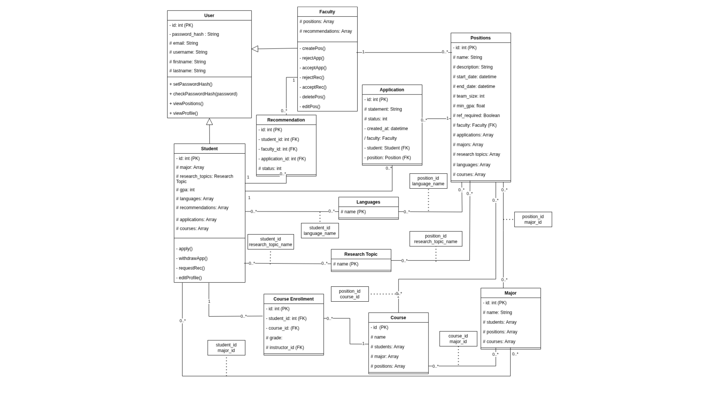
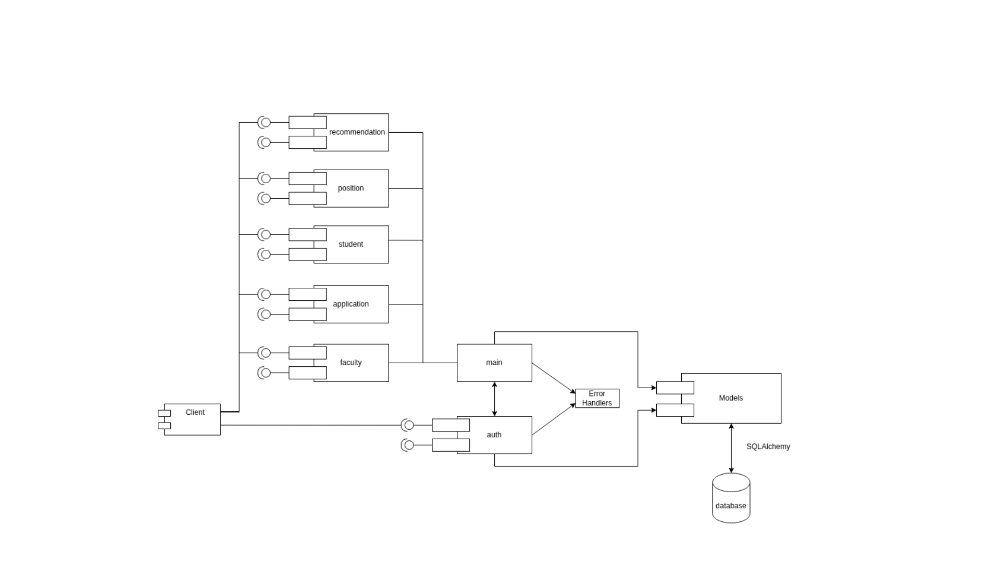
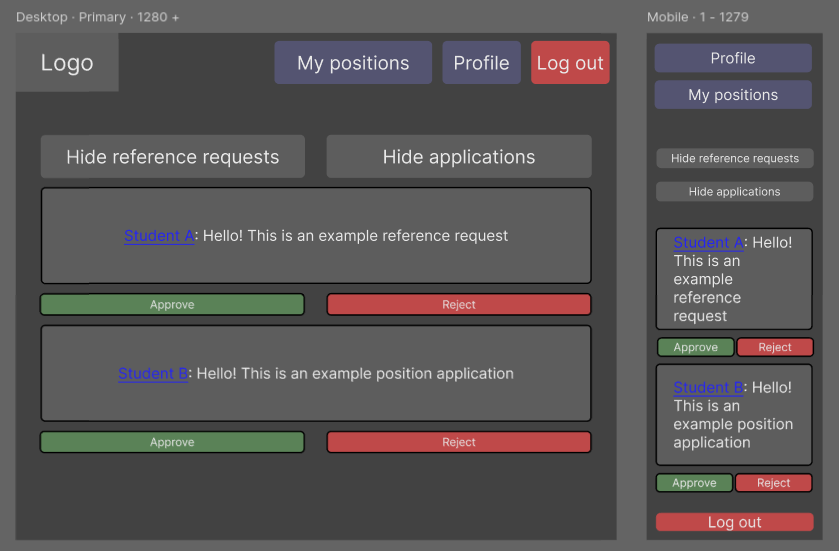
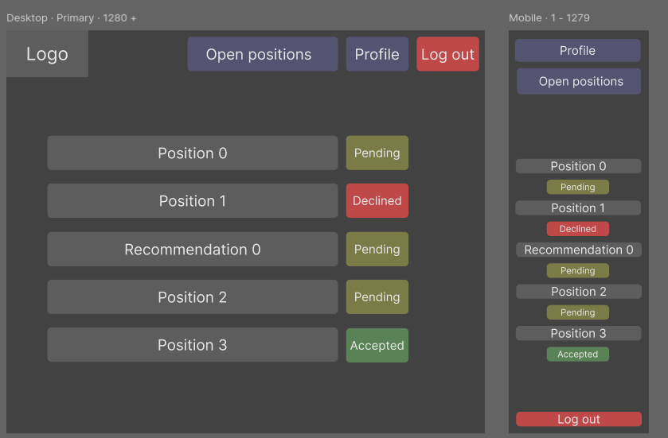

# Project Design Document

## Research Position Matcher
--------
Prepared by:

* `<Kevin Lai>`,`<resumemaxxers>`
* `<Ziyue Chen>`,`<resumemaxxers>`
* `<JimXiang>`,`<resumemaxxers>`
* `<Matvey Shestopalov>`,`<resumemaxxers>`
---

**Course** : CS 3733 - Software Engineering 

**Instructor**: Sakire Arslan Ay

---

## Table of Contents
- [1. Introduction](#1-introduction)
- [2. Software Design](#2-software-design)
    - [2.1 Database Model](#21-model)
    - [2.2 Modules and Interfaces](#22-modules-and-interfaces)
    - [2.2.1 Overview](#221-overview)
    - [2.2.2 Interfaces](#222-interfaces)
    - [2.3 User Interface Design](#23-view-and-user-interface-design)
- [3. References](#3-references)
- [Appendix: Grading Rubric](#appendix-grading-rubric)

<a name="revision-history"> </a>

### Document Revision History

| Name | Date       | Changes | Version |
| ------ |------------| --------- | --------- |
|Revision 1 | 2025-11-11 |Initial draft | 1.0        |
|Revision 2 | 2025-11-14 |Final draft   | 2.0        |


# 1. Introduction

The purpose of this document is to describe the design of the Research Position Matcher app.

# 2. Software Design

## 2.1 Database Model

Class Tables

### Class Tables

*   **Student**: Represents a student user in the system. It stores their profile information, including GPA, and links to their applications, majors, research interests, courses, and applications.
    ```sql
    CREATE TABLE student (
        id INTEGER NOT NULL,
        username VARCHAR(64) NOT NULL,
        firstname VARCHAR(64) NOT NULL,
        lastname VARCHAR(64) NOT NULL,
        email VARCHAR(120) NOT NULL,
        password_hash VARCHAR(256),
        gpa FLOAT,
        PRIMARY KEY (id),
        UNIQUE (username),
        UNIQUE (email)
    );
    ```

*   **Faculty**: Represents a faculty member user. It links to the research positions they have created and the recommendations they have been asked to provide.
    ```sql
    CREATE TABLE faculty (
        id INTEGER NOT NULL,
        username VARCHAR(64) NOT NULL,
        firstname VARCHAR(64) NOT NULL,
        lastname VARCHAR(64) NOT NULL,
        email VARCHAR(120) NOT NULL,
        password_hash VARCHAR(256),
        PRIMARY KEY (id),
        UNIQUE (username),
        UNIQUE (email)
    );
    ```

*   **Position**: Represents a research position created by a faculty member. It contains all the details about the position, including description, requirements, and start/end dates.
    ```sql
    CREATE TABLE position (
        id INTEGER NOT NULL,
        name VARCHAR(100) NOT NULL,
        description VARCHAR(512),
        start_date DATETIME,
        end_date DATETIME,
        team_size INTEGER NOT NULL,
        min_gpa FLOAT,
        faculty_id INTEGER NOT NULL,
        ref_required BOOLEAN NOT NULL,
        PRIMARY KEY (id),
        FOREIGN KEY(faculty_id) REFERENCES faculty (id)
    );
    ```

*   **Application**: Represents a student's application to a specific research Position. It stores the student's statement and the status of the application (e.g., pending, accepted, rejected).
    ```sql
    CREATE TABLE application (
        id INTEGER NOT NULL,
        student_id INTEGER NOT NULL,
        position_id INTEGER NOT NULL,
        statement VARCHAR(1500),
        status VARCHAR(64) NOT NULL,
        created_at DATETIME NOT NULL,
        PRIMARY KEY (id),
        FOREIGN KEY(student_id) REFERENCES student (id),
        FOREIGN KEY(position_id) REFERENCES position (id)
    );
    ```

*   **Major**: A simple table that stores the names of academic majors. It is used to associate students and positions with specific majors.
    ```sql
    CREATE TABLE major (
        id INTEGER NOT NULL,
        name VARCHAR(100) NOT NULL,
        PRIMARY KEY (id),
        UNIQUE (name)
    );
    ```

*   **Course**: Stores information about individual courses, including their name and number. It is linked to a Major.
    ```sql
    CREATE TABLE course (
        id INTEGER NOT NULL,
        name VARCHAR(100) NOT NULL,
        coursenum VARCHAR(10) NOT NULL,
        major_id INTEGER NOT NULL,
        PRIMARY KEY (id),
        FOREIGN KEY(major_id) REFERENCES major (id)
    );
    ```

*   **Recommendation**: Tracks a request from a Student to a Faculty member for a recommendation. It holds the status of the request.
    ```sql
    CREATE TABLE recommendation (
        id INTEGER NOT NULL,
        student_id INTEGER NOT NULL,
        faculty_id INTEGER NOT NULL,
        status VARCHAR(64) NOT NULL,
        PRIMARY KEY (id),
        FOREIGN KEY(student_id) REFERENCES student (id),
        FOREIGN KEY(faculty_id) REFERENCES faculty (id)
    );
    ```

*   **ResearchTopic**: A table to store different research topics. This allows for connecting students' interests and position requirements.
    ```sql
    CREATE TABLE research_topic (
        name VARCHAR(100) NOT NULL,
        PRIMARY KEY (name)
    );
    ```

*   **Language**: A table to store different languages.
    ```sql
    CREATE TABLE language (
        name VARCHAR(100) NOT NULL,
        PRIMARY KEY (name)
    );
    ```

### Association Tables

*   **students_majors**: Links students with their respective majors.
    ```sql
    CREATE TABLE students_majors (
        student_id INTEGER NOT NULL,
        major_id INTEGER NOT NULL,
        PRIMARY KEY (student_id, major_id),
        FOREIGN KEY(student_id) REFERENCES student (id),
        FOREIGN KEY(major_id) REFERENCES major (id)
    );
    ```

*   **students_research_topics**: Links students with their research interests.
    ```sql
    CREATE TABLE students_research_topics (
        student_id INTEGER NOT NULL,
        research_topic_name VARCHAR NOT NULL,
        PRIMARY KEY (student_id, research_topic_name),
        FOREIGN KEY(student_id) REFERENCES student (id),
        FOREIGN KEY(research_topic_name) REFERENCES research_topic (name)
    );
    ```

*   **students_languages**: Links students with the languages they know.
    ```sql
    CREATE TABLE students_languages (
        student_id INTEGER NOT NULL,
        language_name VARCHAR NOT NULL,
        PRIMARY KEY (student_id, language_name),
        FOREIGN KEY(student_id) REFERENCES student (id),
        FOREIGN KEY(language_name) REFERENCES language (name)
    );
    ```

*   **positions_majors**: Links research positions with required academic majors.
    ```sql
    CREATE TABLE positions_majors (
        position_id INTEGER NOT NULL,
        major_id INTEGER NOT NULL,
        PRIMARY KEY (position_id, major_id),
        FOREIGN KEY(position_id) REFERENCES position (id),
        FOREIGN KEY(major_id) REFERENCES major (id)
    );
    ```

*   **positions_research_topics**: Links research positions with relevant research topics.
    ```sql
    CREATE TABLE positions_research_topics (
        position_id INTEGER NOT NULL,
        research_topic_name VARCHAR NOT NULL,
        PRIMARY KEY (position_id, research_topic_name),
        FOREIGN KEY(position_id) REFERENCES position (id),
        FOREIGN KEY(research_topic_name) REFERENCES research_topic (name)
    );
    ```

*   **positions_languages**: Links research positions with required languages.
    ```sql
    CREATE TABLE positions_languages (
        position_id INTEGER NOT NULL,
        language_name VARCHAR NOT NULL,
        PRIMARY KEY (position_id, language_name),
        FOREIGN KEY(position_id) REFERENCES position (id),
        FOREIGN KEY(language_name) REFERENCES language (name)
    );
    ```

*   **positions_courses**: Links research positions with recommended or required courses.
    ```sql
    CREATE TABLE positions_courses (
        position_id INTEGER NOT NULL,
        course_id INTEGER NOT NULL,
        PRIMARY KEY (position_id, course_id),
        FOREIGN KEY(position_id) REFERENCES position (id),
        FOREIGN KEY(course_id) REFERENCES course (id)
    );
    ```

*   **course_enrollment**: Links students to the courses they are enrolled in and stores their grade.
    ```sql
    CREATE TABLE course_enrollment (
        id INTEGER NOT NULL,
        student_id INTEGER NOT NULL,
        course_id INTEGER NOT NULL,
        grade VARCHAR(2),
        PRIMARY KEY (id),
        FOREIGN KEY(student_id) REFERENCES student (id),
        FOREIGN KEY(course_id) REFERENCES course (id)
    );
    ```
    
Provide a UML diagram of your database model showing the associations and relationships among tables. 


## 2.2 Modules and Interfaces

### 2.2.1 Overview
Describe the high-level architecture of your software:  i.e., the major modules/blueprints and how they fit together. Provide a UML component diagram that illustrates the architecture of your software. Briefly mention the role of each module in your architectural design. Please refer to the "System Level Design" lectures in Week 4. 




### 2.2.2 Interfaces

Include a detailed description of the routes your application will implement. 
* Brainstorm with your team members and identify all routes you need to implement for the **completed** application.
* For each route specify its “methods”, “URL path”, and “a description of the operation it implements”.  
* You can use the following table template to list your route specifications. 
* Organize this section according to your module decomposition, i.e., include a sub-section for each module/blueprint and list all routes for that sub-section in a table.  

#### 2.2.2.1 \<Blueprint1> Routes auth.routes

|    | Methods           | URL Path   | Description               |
|:---|:------------------|:-----------|:--------------------------|
| 1. |  'GET', 'POST'  | student/login | student login page        |
| 2. |   'GET', 'POST'  | student/register | student registration page |
| 3. |   'GET'  | student/logout | student logout            |
| 4. |  'GET', 'POST'  | faculty/login   | faculty login page        |
| 5. | 'GET'  | faculty/logout | faculty logout            |
| 6. | 'GET'  | faculty/verify/<token> | faculty verifies email          |
| 7. | 'GET'  | faculty/login/sso | faculty login with Auth0 SSO          |


#### 2.2.2.2 \<Blueprint2> Routes  main.student.routes -- student

|   | Methods      | URL Path                          | Description                              |
|:--|:-------------|:----------------------------------|:-----------------------------------------|
|1. | 'GET'        | student/<student_id>/profile/view | students or faculty view student profile |
|2. | 'GET', 'POST' | student/<student_id>/profile/edit              | student edits their profile              |
|3. | 'GET'        | student/positions | students views positions |
|4. | 'GET'        | student/positions/recommended | students views recommended positions |
| 5. | 'GET', 'POST' | student                 | main route for student |


#### 2.2.2.3 \<Blueprint3> Routes main.faculty.routes -- faculty

|   | Methods           | URL Path                          | Description  |
|:--|:------------------|:----------------------------------|:-------------|
|1. | 'GET' | faculty/<faculty_id>/profile/view | faculty view their profile |
|2. | 'GET', 'POST' | faculty/editlists                 | faculty edit the predefined lists |
| 3. | 'GET', 'POST' | faculty/recommendations           | faculty viewing reference requests from students |
| 4. | 'GET', 'POST' | faculty/positions           | faculty viewing their own positions |
| 5. | 'GET', 'POST' | faculty                 | main route for faculty |

#### 2.2.2.4 \<Blueprint4> Routes main.application.routes -- application

|   | Methods | URL Path                            | Description                                   |
|:--|:--------|:------------------------------------|:----------------------------------------------|
|1. | 'POST'  | application/<application_id>/reject | faculty reject students' application          |
|2. | 'POST'  | application/<application_id>/approve                 | faculty approve students' application         |
|3. | 'POST'  | application/<application_id>/withdraw                | student withdraw their 'pending' applications |
|3. | 'POST'  | application/<application_id>                | page for viewing application details |
|4. | 'GET'   | application                         | page to view all the applications             |

#### 2.2.2.5 \<Blueprint5> Routes main.position.routes -- position

|    | Methods     | URL Path                     | Description                                    |
|:---|:------------|:-----------------------------|:-----------------------------------------------|
| 1. | 'POST'      | position/create              | faculty-only method for creating positions     |
| 2. | 'GET', 'POST' | position/<position_id>/edit                | faculty-only page for editing positions        |
| 3. | 'GET', 'POST' | position/<position_id>/delete              | faculty-only method for deleting a position    |
| 4. | 'GET'       | position/<position_id>/view                | page for viewing position info                 |
| 5. | 'GET', 'POST' | position/<position_id>/apply | student-only method for applying to a position |


#### 2.2.2.6 \<Blueprint6> Routes main.recommendation.routes -- recommendation

|   | Methods | URL Path                                   | Description                                                    |
|:--|:--------|:-------------------------------------------|:---------------------------------------------------------------|
|1. | 'POST'  | recommendation/request | student-only method for requesting a faculty recommendation    |
|2. | 'POST'  | recommendation/<recommendation_id>/reject                      | faculty-only method for rejecting a student rec. request       |
|3. | 'POST'  | recommendation/<recommendation_id>/accept                      | faculty-only method for accepting a student rec. request       |
|4. | 'GET'   | recommendation                             | view incoming (faculty) or sent (student) rec. requests (page) |

Repeat the above for other modules you included in your application. 

### 2.3 User Interface Design 

Provide UI sketches or screenshots for the following pages:
 * Faculty main page

</img>

 * Student main page

</img>

 * Faculty creating a position 

</img>

 * Faculty accepting/rejecting an application

</img>

 * Student applying for a position

</img>


